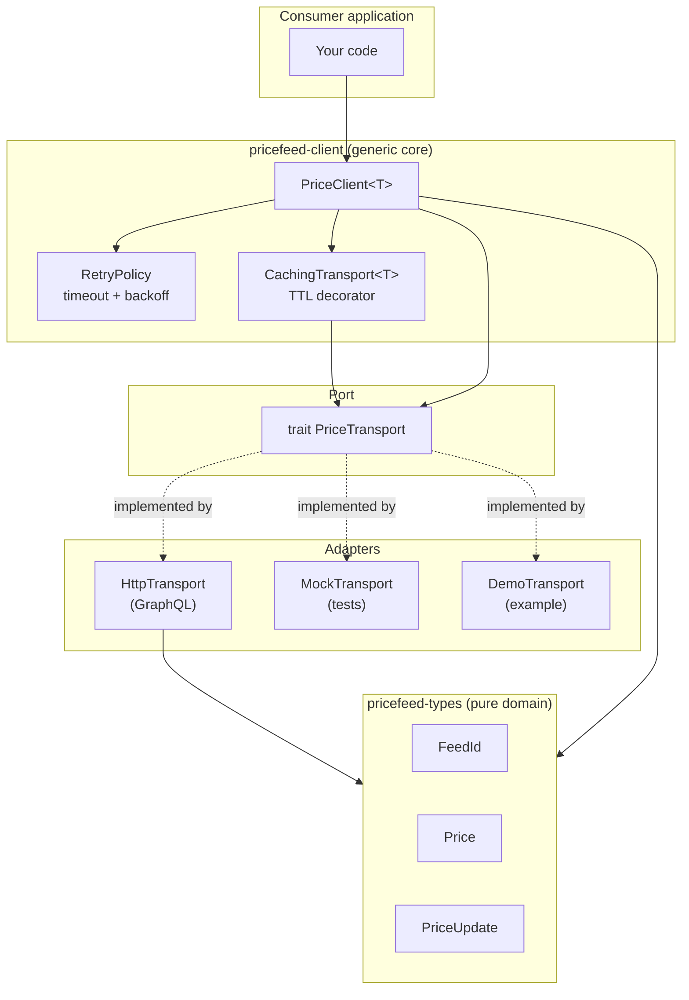

# PriceFeedSDK

A **multi-language consumer SDK** for pull-oracle price feeds. One small, rigorously
typed domain model — mirrored byte-for-byte across **Rust, TypeScript, and Python** —
wrapped in an ergonomic, transport-agnostic client with built-in caching, timeouts,
and exponential-backoff retries.

PriceFeedSDK is the consumer half of the oracle stack: it talks to a GraphQL price
endpoint such as [OracleForge](../OracleForge) or [OracleBridge](../OracleBridge),
but it depends on **nothing** from them — bring any compatible endpoint, or your own
transport.

> Design headline: **developer experience first.** A price you cannot misuse, the
> same semantics in every language, and a client you can extend with one trait.

---

## Table of Contents

- [Why this SDK](#why-this-sdk)
- [Architecture](#architecture)
- [The domain model](#the-domain-model)
  - [Confidence intervals](#confidence-intervals)
  - [Staleness & `price_no_older_than`](#staleness--price_no_older_than)
- [Quick start](#quick-start)
  - [Rust](#rust)
  - [TypeScript](#typescript)
  - [Python](#python)
- [Extending the SDK](#extending-the-sdk)
- [Resilience](#resilience)
- [Workspace layout](#workspace-layout)
- [Building & testing](#building--testing)
- [Benchmarks](#benchmarks)
- [Docker](#docker)
- [Design notes](#design-notes)
- [License](#license)

---

## Why this SDK

Integrating a price oracle is deceptively easy to get wrong: callers forget to check
staleness, ignore the confidence interval, mishandle market halts, or scatter ad-hoc
retry logic across services. PriceFeedSDK makes the **correct** path the **easy** path:

- **Invalid states are unrepresentable.** A `FeedId` is always validated and
  normalized; a `Price` always carries a positive confidence; a `PriceUpdate` always
  has a positive timestamp. Construction enforces the invariant once.
- **One conscious read API.** `price_no_older_than(now, max_age)` returns a price
  *only* if the feed is trading **and** fresh — the same guard Pyth consumers rely on.
- **Identical semantics everywhere.** The Rust core is the source of truth; the
  TypeScript and Python SDKs mirror its validation, scaling, confidence, and
  staleness logic, with a shared set of stable error codes.
- **Composable resilience.** Timeouts, retries, and TTL caching are generic
  decorators over a single `PriceTransport` port — opt in without touching the
  backend.

## Architecture



Dependencies point inward (hexagonal / ports-and-adapters). The domain crate has no
I/O and no async; the client is generic over the transport port; concrete backends
are interchangeable adapters.

## The domain model

| Type | Invariant enforced at construction | Key methods |
|------|-----------------------------------|-------------|
| `FeedId` | non-empty, ≤ 32 chars, `[A-Z0-9./-]`, upper-cased | `new` / `parse`, `as_str` |
| `Price` | confidence is positive (in `PriceUpdate`) | `value`, `confidence_interval`, `confidence_ratio` |
| `PriceStatus` | — | `is_tradeable`, `code` |
| `PriceUpdate` | positive `conf`, positive `publish_time` | `age`, `is_fresh`, `price_no_older_than` |

### Confidence intervals

A price is stored as an integer mantissa with a power-of-ten exponent, plus an
unsigned confidence — never a lossy float. The real value and its symmetric
confidence interval are:

$$
\text{value} = m \cdot 10^{e}, \qquad
\text{interval} = \left[\,(m - c)\cdot 10^{e},\; (m + c)\cdot 10^{e}\,\right]
$$

where $m$ is the mantissa, $c$ the confidence, and $e$ the exponent. The relative
confidence used for quality gating is

$$
\text{ratio} = \frac{c}{\lvert m \rvert},
$$

defined as $\infty$ when $m = 0$ so an undefined ratio reads as "maximally uncertain".

### Staleness & `price_no_older_than`

$$
\text{age}(now) = \max(0,\; now - t_{\text{publish}}), \qquad
\text{fresh} \iff \text{age}(now) \le \text{max\_age}
$$

`price_no_older_than(now, max_age)` returns the price only when the status is
`Trading` **and** the update is fresh; otherwise it raises a typed `not_trading` or
`stale` error.

## Quick start

### Rust

```rust
use std::time::Duration;
use pricefeed_client::{CachingTransport, PriceClient, RetryPolicy};
use pricefeed_http::HttpTransport;
use pricefeed_types::FeedId;

#[tokio::main]
async fn main() -> anyhow::Result<()> {
    let transport = HttpTransport::new("http://localhost:8080/graphql")?;
    let cached = CachingTransport::new(transport, Duration::from_millis(500));
    let client = PriceClient::with_policy(cached, RetryPolicy::default());

    let feed = FeedId::new("BTC/USD")?;
    let price = client
        .get_price_no_older_than(&feed, now_unix(), Duration::from_secs(30))
        .await?;
    println!("BTC/USD = {price}");
    Ok(())
}
# fn now_unix() -> i64 { 0 }
```

Run the bundled example watcher (no server needed):

```bash
cargo run -p pricefeed-watch -- --demo --rounds 5
```

### TypeScript

```ts
import { PriceClient, CachingTransport, HttpTransport, FeedId } from "@pricefeed/sdk";

const transport = new CachingTransport(
  new HttpTransport("http://localhost:8080/graphql"),
  500,
);
const client = new PriceClient(transport);

const price = await client.getPriceNoOlderThan(
  FeedId.parse("BTC/USD"),
  Math.floor(Date.now() / 1000),
  30,
);
console.log(`BTC/USD = ${price.toString()}`);
```

### Python

```python
import asyncio, time
from pricefeed_sdk import PriceClient, CachingTransport, HttpTransport, FeedId

async def main() -> None:
    transport = CachingTransport(HttpTransport("http://localhost:8080/graphql"), ttl_s=0.5)
    client = PriceClient(transport)
    price = await client.get_price_no_older_than(FeedId.parse("BTC/USD"), int(time.time()), 30)
    print(f"BTC/USD = {price}")

asyncio.run(main())
```

## Extending the SDK

The single extension point is the `PriceTransport` port. Implement `fetch` and you
get caching, retries, timeouts, and the conveniences for free:

```rust
use async_trait::async_trait;
use pricefeed_client::{ClientError, PriceTransport};
use pricefeed_types::{FeedId, PriceUpdate};

struct MyTransport;

#[async_trait]
impl PriceTransport for MyTransport {
    async fn fetch(&self, feed: &FeedId) -> Result<PriceUpdate, ClientError> {
        // ...your gRPC / websocket / on-chain RPC here...
        todo!()
    }
}
```

`CachingTransport<T>` is itself a `PriceTransport`, so decorators compose:
`PriceClient::new(CachingTransport::new(MyTransport, ttl))`.

## Resilience

| Concern | Mechanism | Where |
|---------|-----------|-------|
| Slow backend | per-attempt timeout | `RetryPolicy::per_attempt_timeout` |
| Transient failures | exponential backoff retry, retryable-only | `run_with_policy` |
| Redundant load | TTL cache decorator | `CachingTransport` |
| Permanent errors | no retry (fail fast) | `ClientError::is_retryable` |

Errors carry a stable `code()` (`not_found`, `timeout`, `transport`, `domain`,
`stale`, `not_trading`, …) so callers branch on a string that is identical in all
three languages.

## Workspace layout

```
PriceFeedSDK/
├── crates/
│   ├── pricefeed-types/     # pure domain: FeedId, Price, PriceUpdate (+ proptests)
│   ├── pricefeed-client/    # generic PriceClient<T>, retry, cache, MockTransport
│   └── pricefeed-http/      # HttpTransport (reqwest → GraphQL) + offline parser
├── examples-dapp/           # pricefeed-watch CLI (demo + live modes)
├── typescript/              # @pricefeed/sdk npm package (mirrors the core)
├── python/                  # pricefeed-sdk package (mirrors the core)
├── postman/                 # the GraphQL queries the SDK issues
├── Dockerfile, docker-compose.yml
└── .github/workflows/ci.yml # Rust + TypeScript + Python jobs
```

## Building & testing

```bash
# Rust: 28 unit/integration tests + property tests + doctests
cargo test --workspace --all-features
cargo clippy --all-targets --all-features -- -D warnings
cargo fmt --all -- --check

# TypeScript: 10 tests (node:test)
cd typescript && npm install && npm test

# Python: 15 tests (stdlib unittest, no third-party deps)
cd python && python3 -m unittest discover -s tests -v
```

## Benchmarks

`criterion` microbenchmarks cover the hot paths (representative local numbers):

| Benchmark | Time | Complexity |
|-----------|------|------------|
| `price/confidence_interval` | ~3.9 ns | $O(1)$ |
| `price/confidence_ratio` | ~1.4 ns | $O(1)$ |
| `cache/hit` | ~149 ns | $O(1)$ amortized |
| `client/get` (no-op transport) | ~133 ns | $O(1)$ + transport |

```bash
cargo bench -p pricefeed-client
```

## Docker

```bash
docker compose up --build        # runs the demo watcher
# point at a live endpoint:
docker run --rm -e PRICEFEED_ENDPOINT=http://host.docker.internal:8080/graphql \
  pricefeed-sdk:latest BTC/USD ETH/USD
```

## Design notes

- **Generics over dynamism.** `PriceClient<T>` is monomorphized per transport, so the
  resilience layer adds no virtual-call overhead; `Arc<dyn PriceTransport>` is still
  supported for type-erased composition.
- **Mantissa/exponent, not floats.** Exact on-chain semantics survive the trip into
  every binding; floats appear only at the display boundary.
- **Stable error codes** form the cross-language contract and double as a
  machine-readable API for callers and dashboards.
- **No I/O in the domain crate** keeps the core trivially testable and reusable.

## License

MIT OR Apache-2.0.
